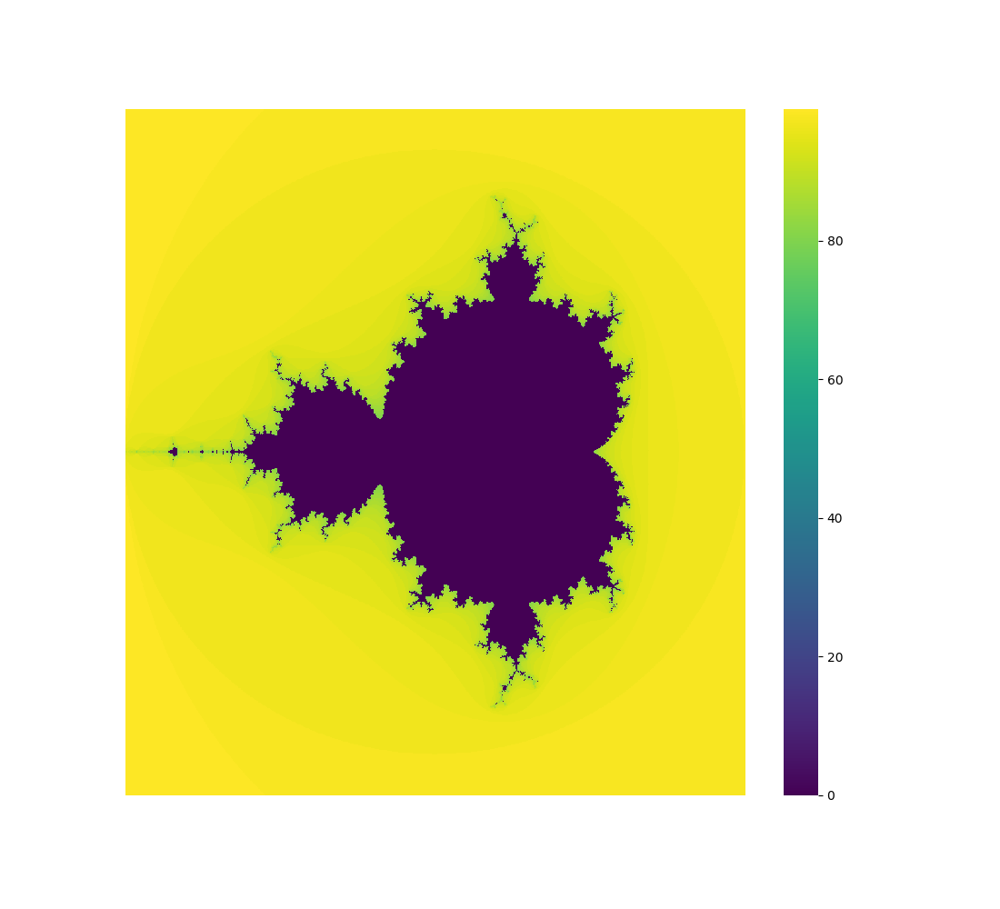
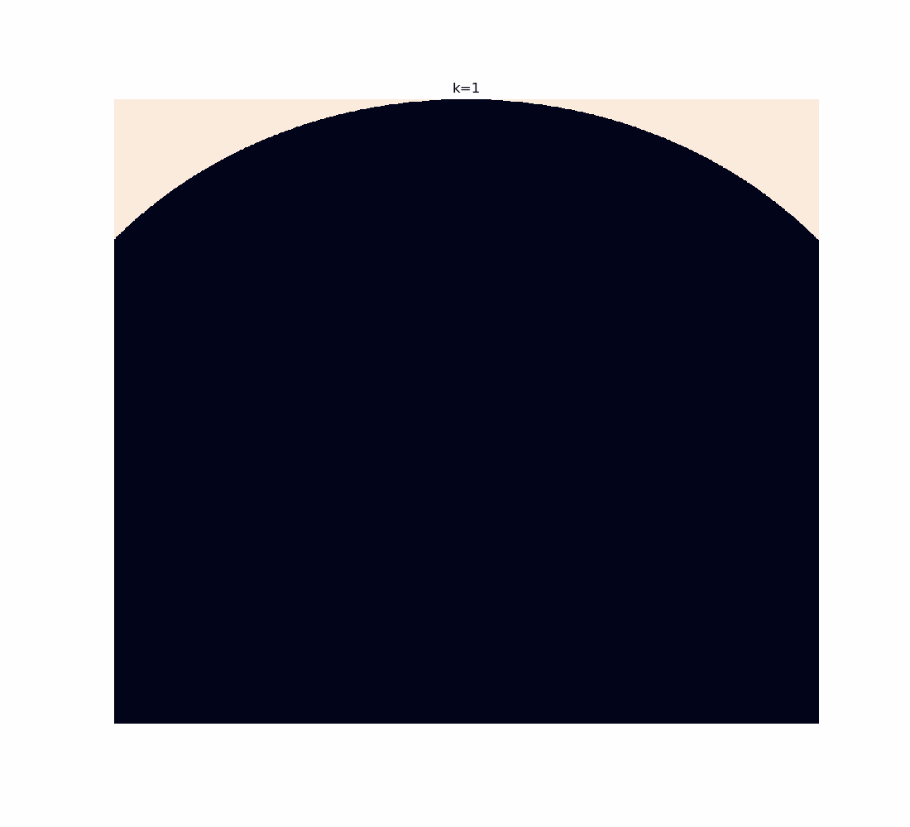
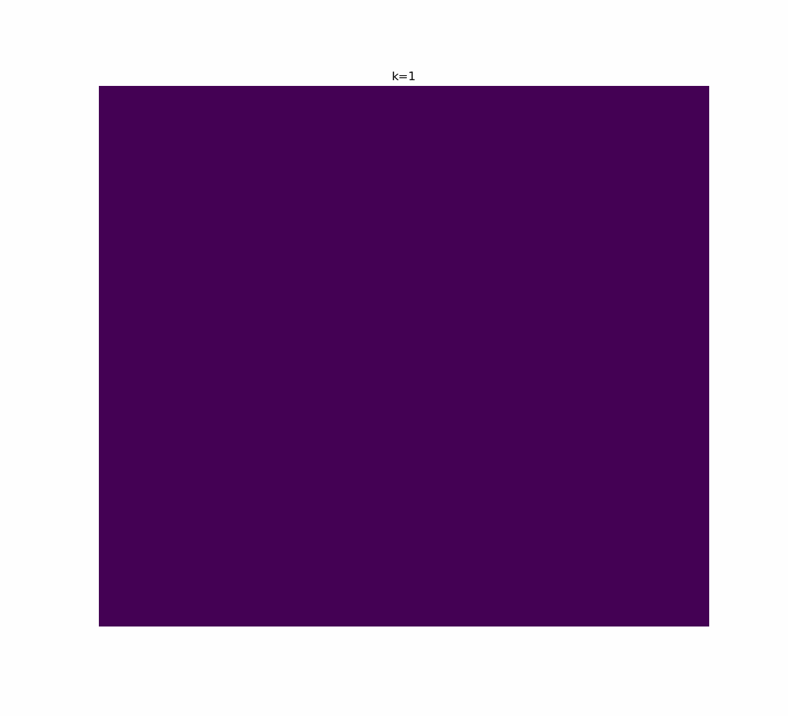

# mandelbrot
Just fooling around with NumPy and Seaborn in Jupyter Notebooks.
However, I *did* implement the Mandelbrot set recursive equation in NumPy.
I *did* introduce successive zooming ("zoom levels") into chosen domain area and I *did* address some problems with "relics" that apperaed on images (details to follow).
All in all, it was valuable experience. The notebooks need cleaning, but I'm too busy watching fractals.

